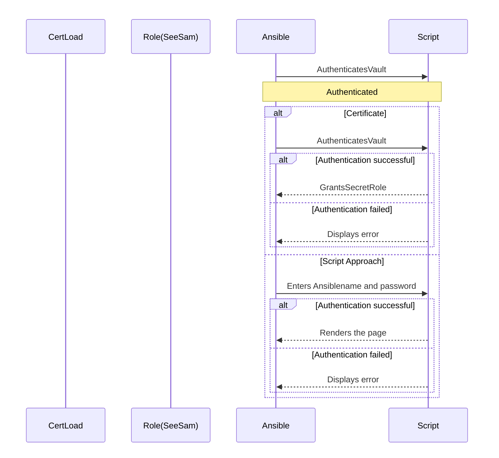

## Ansible Login Sequence

This diagram illustrates the Ansible login process.

```mermaid
sequenceDiagram
    participant CertLoad
    participant Role(SeeSam)
    participant Ansible
    participant Script
    Ansible->>Script: AuthenticatesVault
    Note over Ansible,Script: Authenticated


    box "Certificate"
    end
    alt Certificate
        Ansible->>Script: AuthenticatesVault
        alt Authentication successful
            Script-->>Ansible: GrantsSecretRole
        else Authentication failed
            Script-->>Ansible: Displays error
        end
    else Script Approach
        Ansible->>Script: Enters Ansiblename and password
        alt Authentication successful
            Script-->>Ansible: Renders the page
        else Authentication failed
            Script-->>Ansible: Displays error
        end
    end
```
